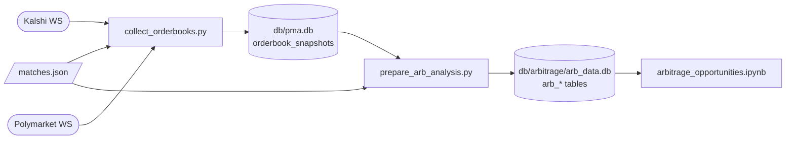

# Arbitrage Data Collection

Live orderbook capture for the cross-platform arbitrage analysis
(`analysis/arbitrage_opportunities.ipynb`). Takes `matches.json` from the
matcher (see `market-matching.md`), streams both venues' books, and
freezes an analysis dataset.

Two layers: collect (append-only capture) and prepare (frozen,
analysis-ready tables).

## Collector

`db/arbitrage/collect_orderbooks.py`, run via `/collect-arb-data`. Runs
until interrupted; safe to stop and restart (append-only).

- **Kalshi**: websocket `orderbook_delta` channel. The full book is
  reconstructed locally from a snapshot plus deltas; NO bids convert to
  YES asks (ask = 1 - best NO bid). Sequence gaps force a reconnect for
  fresh snapshots. Crossed states are never recorded, and a book that
  stays crossed for 25 consecutive reconstructions is a dead market
  (settled/halted): it is blacklisted for the session rather than
  triggering reconnects. Matches whose `event_date` is past are skipped
  at startup.
- **Polymarket US**: websocket market-data subscription, full top-of-book
  on every update.
- Every message is validated through pydantic models (`ws_models.py`);
  invalid messages are logged and skipped.
- Snapshots are buffered in memory and flushed to DuckDB off the event
  loop (batch size 100 or every 30s), so receive loops never block on the
  database.
- Reconnects use jittered exponential backoff (1s to 60s). A 401/403
  handshake stops the collector instead of retrying.

**Storage is as-received.** No direction flip, no rounding. Prices land in
`orderbook_snapshots` in `db/pma.db` as TEXT (timestamp, platform,
market_id, match_id, best bid/ask, sizes, mid); the
`orderbook_snapshots_typed` view casts to numerics. If a match's direction
is ever corrected, the capture stays valid and only the prep step reruns.

## Preparation

`db/arbitrage/prepare_arb_analysis.py`, run manually after a collection
window. Writes a frozen `db/arbitrage/arb_data.db` so finished analysis
numbers cannot silently move while collection continues.

- Normalizes Polymarket rows onto the Kalshi YES basis here: for
  `kalshi_yes_eq_poly_no` matches, bid/ask become 1-ask/1-bid and sizes
  swap.
- `arb_events`: deduped top-of-book change events per platform per match.
- `arb_aligned`: one row per book change on either venue, carrying both
  venues' latest book (ASOF join) plus each leg's age in seconds.
- `arb_matches`: match metadata from `matches.json`.
- `arb_build_info`: row counts and time span of the freeze.

## Tests

`uv run pytest db/arbitrage/`: book reconstruction and writer units,
websocket model validation, direction normalization in prep, and
post-collection reasonability checks on the captured data
(`test_arb_data_quality.py`).

## Workflow

1. `/matcher` to refresh matches.
2. `/collect-arb-data` for the collection window.
3. `prepare_arb_analysis.py` to freeze the dataset for the notebook.
