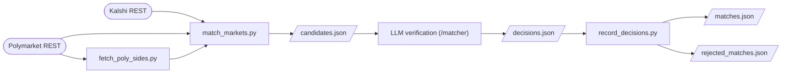

# Market Matching

How cross-platform market pairs (Kalshi vs Polymarket US) are found and
verified. Scope is sports only, any league, any bet type (decision
2026-07-21). Output is `db/arbitrage/matches.json`, the input to the
orderbook collector (see `arb-data-collection.md`).

Matching is two stages: a deterministic candidate generator, then an LLM
verification pass run by Claude via `/matcher`. The generator's job is
recall and evidence-gathering; the judgment — same event, correct
sub-market, direction — is made by the LLM from the settlement texts both
platforms publish. Regex verification was tried first and retired
2026-07-22: encoding "same real-world event" as string rules produced
silent wrong matches (a CS2 event approved against a Valorant market, the
men's and women's Hundred confused) that the settlement texts trivially
distinguish.



## Stage 1: candidate generation

`db/arbitrage/match_markets.py`, run via `/matcher`.

1. **Fetch.** All Kalshi series and open events, all Polymarket US markets
   with `endDateMin = today`. Every REST response is validated through
   pydantic models (`api_models.py`); invalid entries are skipped with a
   warning.
2. **Group.** Kalshi events get category (from series) and a sport code
   (league keywords in the series title, else tokens in the series
   ticker — `KXCS2MAP` → cs2). Polymarket markets with a `line` (spreads,
   totals) stay individual so distinct lines match independently; the rest
   group by game. Poly sport codes come from slug prefixes
   (`aec`, `asc`, `astatc`, ...).
3. **Filter.** Sports only, then four gates per pair: category equality,
   sport-code equality (missing passes), bet type, and exact date
   equality. The bet-type gate is strict: the Kalshi series suffix
   (`F5SPREAD`, `SETWINNER`, `HRR`, ...) and the Poly type plus slug
   markers (`-f5-`, `-gs-`, `-hrr-`, `-mapN`, ...) must both classify,
   and to the same type; unclassifiable pairs are rejected. Player props
   additionally require team codes to agree between ticker and slug
   (fail-closed). Pairs are blocked by date first, so each Kalshi event
   only scores against same-day markets.
4. **Score.** Jaccard similarity on normalized title tokens, threshold
   0.3. Best candidate per Poly slug wins.
5. **Enrich.** For each new candidate the script fetches the verification
   evidence and embeds it inline: every Kalshi sub-market's
   `rules_primary` (settlement rules text) and `expected_expiration_time`,
   and the Poly market detail's `description` (settlement text) and YES
   side (`marketSides` entry with `long: true`, via
   `fetch_poly_sides.py`).
6. **Output.** New candidates (unknown slugs) are written to
   `candidates.json`.

The script also initializes `matches.json` / `rejected_matches.json` and
moves matches whose event has ended to `matches_archive.json` (metadata is
never deleted — the analysis freeze needs each match's direction for as
long as its captured rows exist; see `arb-data-collection.md`).

## Stage 2: LLM verification

`/matcher` (`.claude/commands/matcher.md`) has Claude verify every
candidate against a fixed checklist — by reading, in batches grouped by
game. Its output is data, never code: decisions go to a transient
`decisions.json`, and the committed `record_decisions.py` tool validates
the schemas, appends to `matches.json` / `rejected_matches.json`
idempotently, enforces the match-file invariants (unique ids, valid
directions, expiry info present, no Kalshi market matched to more than
one Poly market), and consumes the decisions file. Fail-safe rule:
anything not decidable with confidence is rejected with a reason, never
approved. Writing verification logic (rules, keyword matching) during the
review is explicitly forbidden — that is stage-2-as-regex again.

The decisive evidence is the settlement texts. Titles and questions alone
are not sufficient — right-team-wrong-game candidates score well on
titles, and the men's and women's Hundred are textually identical outside
the settlement texts (same teams, same date; observed 2026-07-23). The
checklist requires: same real-world event per the settlement texts
(competition, gender, opponent, start time), exact date, same bet type,
exact line for spreads/totals, equal settlement terms (regulation time vs
full match), and the direction procedure below. Two-outcome events
produce a pair of entries with opposite directions; events with a
Tie/Draw outcome (or Poly type `SPORTS_MARKET_TYPE_DRAWABLE_OUTCOME`) get
only the YES-side entry, because the other sub-market is not the
complement.

**Direction** is the highest-risk step (poka-arb once lost $68 to a wrong
direction). The Poly YES side is always taken from the market detail
endpoint (the `marketSides` entry with `long: true`), fetched mechanically
into the candidate by stage 1. It is never inferred from slug order,
home/away, ticker abbreviations, or ambiguous question text. (On
2026-07-21 all 54 live MLB moneylines had YES = away team, but the
convention does not hold across sports and is treated as coincidence.)

Approved matches append to `matches.json`:

```json
{
  "id": "<polymarket_slug>--<outcome_suffix>",
  "kalshi_ticker": "...",
  "polymarket_slug": "...",
  "direction": "kalshi_yes_eq_poly_yes",
  "poly_yes": "Texas Rangers",
  "event_date": "2026-07-10",
  "expires": "2026-07-11T03:00:00Z",
  "notes": "..."
}
```

`poly_yes` records the verified YES side (audit trail); `expires`
(Kalshi's `expected_expiration_time`) drives automatic pruning, with
`event_date` as fallback. Rejections go to `rejected_matches.json` with a
reason; rejected slugs are never re-scored.

## Files

| File | Role |
|---|---|
| `db/arbitrage/match_markets.py` | candidate generation + enrichment, match-file maintenance |
| `db/arbitrage/kalshi_adapter.py`, `poly_adapter.py` | REST fetch, validated |
| `db/arbitrage/api_models.py` | pydantic models for REST responses |
| `db/arbitrage/fetch_poly_sides.py` | Poly detail fetch (YES side + description) |
| `db/arbitrage/record_decisions.py` | stage 2 decision recorder (validate, append, invariants) |
| `db/arbitrage/candidates.json` | stage 1 output, stage 2 input |
| `db/arbitrage/matches.json`, `rejected_matches.json` | stage 2 output |
| `db/arbitrage/matches_archive.json` | expired matches (metadata retained for analysis) |
| `.claude/commands/matcher.md` | stage 2 checklist and procedure |
