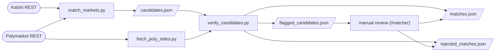

# Market Matching

How cross-platform market pairs (Kalshi vs Polymarket US) are found and
verified. Scope is sports only, any league, any bet type (decision
2026-07-21). Output is `db/arbitrage/matches.json`, the input to the
orderbook collector (see `arb-data-collection.md`).

Matching is two stages: a deterministic candidate generator, then a manual
verification pass.



## Stage 1: candidate generation

`db/arbitrage/match_markets.py`, run via `/matcher`.

1. **Fetch.** All Kalshi series and open events, all Polymarket US markets
   with `endDateMin = today`. Every REST response is validated through
   pydantic models (`api_models.py`); invalid entries are skipped with a
   warning.
2. **Group.** Kalshi events get category (from series) and a sport code
   (league keywords in the series title). Polymarket markets with a `line`
   (spreads, totals) stay individual so distinct lines match independently;
   the rest group by game. Poly sport codes come from slug prefixes
   (`aec`, `asc`, `astatc`, ...).
3. **Filter.** Sports only, then four gates per pair: category equality,
   sport-code equality (missing passes), bet type, and exact date
   equality. The bet-type gate is strict: the Kalshi series suffix
   (`F5SPREAD`, `SETWINNER`, `HRR`, ...) and the Poly type plus slug
   markers (`-f5-`, `-gs-`, `-hrr-`, `-mapN`, ...) must both classify,
   and to the same type; unclassifiable pairs are rejected. Pairs are
   blocked by date first, so each Kalshi event only scores against
   same-day markets.
4. **Score.** Jaccard similarity on normalized title tokens, threshold
   0.3. Best candidate per Poly slug wins.
5. **Output.** New candidates (unknown slugs) are written to
   `candidates.json` with the event's Kalshi sub-markets, the Poly `line`,
   and `game_start_time`.

The script also initializes `matches.json` / `rejected_matches.json` and
prunes matches whose `event_date` has passed.

## Stage 2: verification

`db/arbitrage/verify_candidates.py` applies the checklist in
`.claude/commands/matcher.md` mechanically: same real-world event (name
and team-code matching, with rules for Kalshi's truncated team labels),
exact line for spreads and totals, correct Kalshi sub-market, direction
from the fetched YES side. It is fail-safe: anything that does not parse
or match cleanly is flagged to `flagged_candidates.json` for human review
or rejected, never approved. Two project judgments are encoded in it:
Kalshi markets that settle on regulation time are rejected when the Poly
question does not state regulation, and events with a Tie outcome get
only a YES-side entry (the other team's sub-market is not the
complement). Claude reviews the flagged remainder manually.

**Direction** is the highest-risk step (poka-arb once lost $68 to a wrong
direction). The Poly YES side is always taken from the market detail
endpoint via `fetch_poly_sides.py`: the `marketSides` entry with
`long: true`. It is never inferred from slug order, home/away, ticker
abbreviations, or ambiguous question text. (On 2026-07-21 all 54 live MLB
moneylines had YES = away team, but the convention does not hold across
sports and is treated as coincidence.)

Approved matches append to `matches.json`:

```json
{
  "id": "<polymarket_slug>-<outcome_suffix>",
  "kalshi_ticker": "...",
  "polymarket_slug": "...",
  "direction": "kalshi_yes_eq_poly_yes",
  "poly_yes": "Texas Rangers",
  "event_date": "2026-07-10",
  "notes": "..."
}
```

`poly_yes` records the verified YES side (audit trail); `event_date`
drives automatic pruning. Rejections go to `rejected_matches.json` with a
reason. A game with two Kalshi sub-markets and one Poly market produces
two entries, one `kalshi_yes_eq_poly_yes` and one `kalshi_yes_eq_poly_no`.

## Files

| File | Role |
|---|---|
| `db/arbitrage/match_markets.py` | candidate generation, match-file maintenance |
| `db/arbitrage/kalshi_adapter.py`, `poly_adapter.py` | REST fetch, validated |
| `db/arbitrage/api_models.py` | pydantic models for REST responses |
| `db/arbitrage/fetch_poly_sides.py` | Poly YES-side lookup CLI |
| `db/arbitrage/verify_candidates.py` | stage 2 mechanical verification |
| `db/arbitrage/candidates.json` | stage 1 output, stage 2 input |
| `db/arbitrage/matches.json`, `rejected_matches.json` | stage 2 output |
| `db/arbitrage/flagged_candidates.json` | stage 2 review queue |
| `.claude/commands/matcher.md` | operational checklist for stage 2 |
