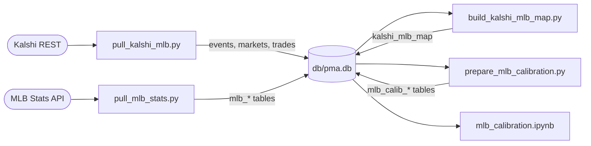

# MLB Game Winners Data Pull

Historical dataset behind the calibration analysis
(`analysis/mlb_calibration.ipynb`): every trade on Kalshi's MLB Game
Winner markets (series `KXMLBGAME`) joined to actual game outcomes from
the MLB Stats API. Full methodology write-up:
`write_ups/pulling-every-mlb-trade-from-kalshi.md`.

Three layers in `db/game_winners/` (pull -> build -> prepare), all writing
to `db/pma.db`. `refresh.py` runs the pull and build layers; prepare runs
manually.

## Pull

`pull_kalshi_mlb.py`: events, markets, and trades for `KXMLBGAME`.
Kalshi splits trades across `/markets/trades` (recent) and
`/historical/trades` (older than a moving cutoff); the script hits both
and dedupes by trade id. Fully pulled finalized markets are recorded in
`kalshi_trade_pulls` and skipped on later runs; partially pulled markets
resume from their latest trade timestamp. Events missing from the events
endpoint but referenced by markets are fetched individually.

`pull_mlb_stats.py`: schedule from 2025-04-16 (first Kalshi MLB listing)
onward in month-sized chunks, deduped by `game_pk`, into `mlb_games`;
then per-game play-by-play (`mlb_plays`), win probability
(`mlb_win_probability`), and weather (`mlb_weather`) for finalized games.
Resume bookkeeping in `mlb_game_pulls`; games returning 404 are retried
for 14 days, then skipped.

Both pulls validate every response through pydantic models, retry
transient errors with jittered exponential backoff (tenacity), store
prices as TEXT with typed views, and are idempotent: re-running only
fetches what is new.

## Build

`build_kalshi_mlb_map.py`: joins the two mirrors into `kalshi_mlb_map`
(event_ticker <-> game_pk). Neither API knows about the other, so the
join is reconstructed from the ticker:

- 2025 format `KXMLBGAME-25SEP24KCLAA`: date + team pair, `G1`/`G2`
  suffix for doubleheaders.
- 2026 format `KXMLBGAME-26APR301235STLPIT`: adds scheduled start time
  (US/Eastern).
- The team pair concatenates the two market suffixes, away team first
  (verified across every date-matched event).

Candidates are schedule games on the ticker date with the same teams.
Doubleheaders disambiguate by suffix, start-time proximity, or market
settlement time; postponed games fall back to a settlement-time search up
to 200 days forward. The build prints a match report and fails loudly if
the match rate drops below threshold (99.6% at last full run; misses are
cancelled or not-yet-replayed games).

## Prepare

`prepare_mlb_calibration.py`: analysis-specific `mlb_calib_*` tables
(pre-game and per-inning price snapshots, window trades). Run manually,
not from `refresh.py`, so a finished analysis's dataset stays frozen.

## Tests

`uv run pytest db/game_winners/`: ticker-parsing and game-matching units,
plus reasonability checks on the pulled data (price validity, trade
timing, parent integrity, result agreement).
